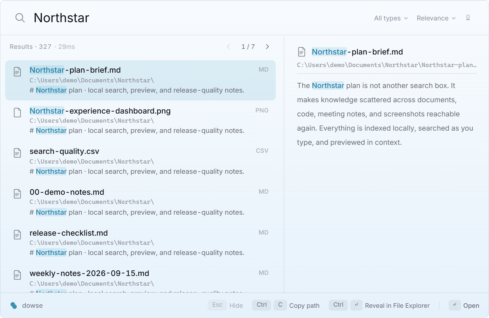

[English](README.md) | [简体中文](README.zh-CN.md) | [日本語](README.ja.md) | 한국어 | [Español](README.es.md) | [Italiano](README.it.md)

<p align="center">
  
</p>

<h1 align="center">dowse</h1>

<p align="center">
  Windows용 오픈 소스 로컬 파일 전문 검색 도구입니다. 파일 이름, PDF와 Office 문서, 소스 코드, 스크린샷 속 텍스트를 하나의 단축키로 검색할 수 있습니다.
</p>

<p align="center">
  <a href="https://lter.space/dowse/">웹사이트</a> ·
  <a href="https://github.com/ltspace/dowse/releases/latest">최신 버전 다운로드</a>
</p>



## 주요 기능

| | |
|---|---|
| 🔍 **파일 이름 검색** | 입력하는 즉시 빠르게 검색 |
| 📄 **문서 본문 검색** | 텍스트, Markdown, 코드, PDF, Word, Excel, PowerPoint |
| 🖼️ **이미지 OCR** | Windows.Media.Ocr로 PNG / JPG / WebP / BMP의 텍스트를 완전히 오프라인으로 인식 |
| 🈶 **중국어 단어 분리** | trigram 대신 jieba + BM25를 사용하고 GBK 인코딩을 자동 감지 |
| ⚡ **증분 인덱싱** | 실행 중 파일 감시와 시작 시 변경 사항 대조 |
| 🤖 **MCP 서버** | stdio를 통해 로컬 검색 기능을 AI 에이전트에 제공 |
| 🚀 **NTFS 빠른 경로** | 관리자 권한에서 MFT + USN Journal을 사용하고, 사용할 수 없으면 자동으로 일반 방식으로 전환 |

데이터와 인덱스는 PC에만 저장됩니다. 네트워크 전송이나 텔레메트리는 없습니다.

## 빠른 시작

[최신 릴리스](https://github.com/ltspace/dowse/releases/latest)에서 `dowse-app_*_x64-setup.exe`를 내려받아 설치한 뒤 `Alt+\``를 누르세요.

설치 프로그램은 서명되지 않았습니다. Windows SmartScreen이 표시되면 **추가 정보**를 누른 다음 **실행**을 선택하세요.

소스에서 빌드하려면:

```powershell
git clone https://github.com/ltspace/dowse && cd dowse

# CLI
cargo run -p dowse -- index D:\docs
cargo run -p dowse -- search keyword

# Tauri 오버레이
cd crates/dowse-app
npm install
cargo tauri build
```

## 오버레이 조작

- `Alt+\``: 표시 / 숨기기
- `↑` / `↓`: 결과 선택, 페이지 경계에서는 이전/다음 페이지로 이동
- `Enter`: 파일 열기
- `Ctrl+Enter`: 파일 탐색기에서 위치 열기
- `Ctrl+C`: 경로 복사
- `Esc`: 숨기기
- `Ctrl+P`: 파일 형식 필터
- `Ctrl+S`: 정렬
- `Ctrl+,`: 설정

검색 결과는 페이지당 50개씩 표시됩니다. 결과가 여러 페이지일 때만 결과 제목에 간결한 `‹ 1 / N ›` 컨트롤이 나타납니다.

## MCP 서버

`dowse mcp`는 로컬 인덱스를 읽기 전용으로 노출하는 stdio MCP 서버를 시작합니다.

```text
claude mcp add --scope user dowse -- dowse mcp
```

`search`, `preview`, `index_status` 세 가지 도구를 제공합니다. `search`는 `limit` / `offset` 페이지네이션, 전체 결과 수, 확장자 필터와 정렬을 지원합니다.

## 기술 스택

Rust · tantivy · jieba · Tauri 2 · Svelte 5 · Windows.Media.Ocr · Win32 (MFT / USN Journal)

## 라이선스

[MIT](LICENSE-MIT) 또는 [Apache-2.0](LICENSE-APACHE) 이중 라이선스입니다.
