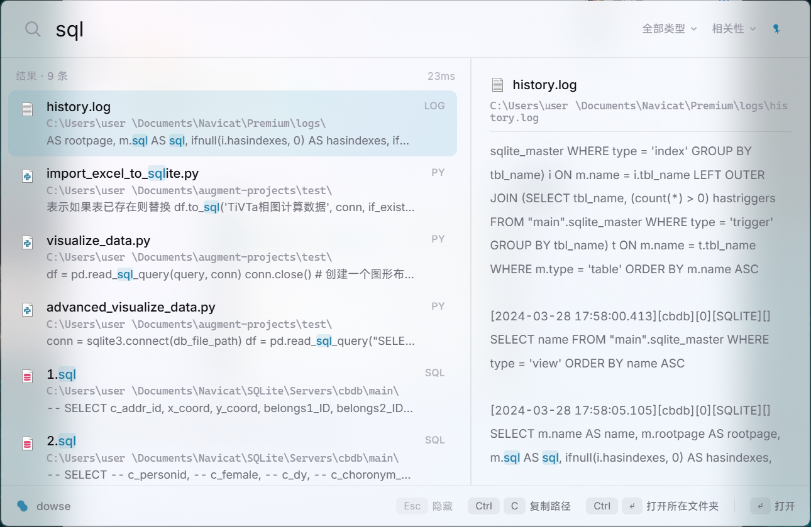
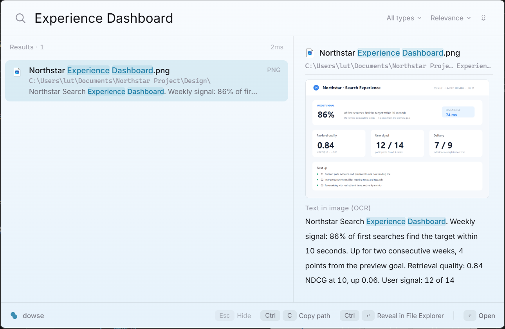

English | [简体中文](README.zh-CN.md)

<p align="center">
  
</p>

<h1 align="center">dowse</h1>

<p align="center">
  Native full-text search for Windows. File names, document contents, and text inside screenshots — one hotkey away.
</p>

<p align="center">
  <a href="#license"></a>
  <a href="https://github.com/ltspace/dowse/releases/latest"></a>
  <a href="https://github.com/ltspace/dowse/actions/workflows/ci.yml"></a>
  <a href="https://github.com/ltspace/dowse/stargazers"></a>
  
  <a href="https://www.rust-lang.org"></a>
  <a href="https://github.com/ltspace/dowse/releases"></a>
  <a href="https://glama.ai/mcp/servers/ltspace/dowse"></a>
</p>

The name comes from a dowsing rod.



## Motivation

No Windows tool satisfies all three of the following at once:

- Search file contents, not just file names (Everything only does the latter)
- Recognize and index text inside images (macOS Spotlight has this; there is no equivalent on Windows)
- One hotkey to summon, full keyboard operation, no perceptible latency

The closest open-source implementation is sist2, but it targets Linux (on Windows it only runs via Docker), treats Chinese text as trigrams, and the project is no longer maintained. dowse is a Windows-native implementation built around these three points.

## Features

| | |
|---|---|
| 🔍 **File name search** | Instant, as you type |
| 📄 **Document content search** | Plain text, Markdown, code, and document formats (PDF, Word, Excel, PowerPoint) |
| 🖼️ **Screenshot / image OCR** | Text inside PNG/JPG/WebP/BMP images, fully offline (Windows.Media.Ocr) |
| 🈶 **Chinese word segmentation** | jieba + BM25 ranking, not trigrams — plus automatic GBK encoding detection |
| ⚡ **Incremental indexing** | File-watch during runtime, mtime/size reconciliation at startup |
| 🤖 **MCP server** | Exposes local search to AI agents over stdio |
| 🚀 **NTFS fast path** | MFT enumeration + USN Journal, admin-only, falls back transparently otherwise |

## dowse vs. the alternatives

| | dowse | Everything | Windows Search | sist2 |
|---|:---:|:---:|:---:|:---:|
| File name search | ✓ | ✓ | ✓ | ✓ |
| Document content search | ✓ | ✗ | partial, slow | ✓ |
| Screenshot / image OCR | ✓ | ✗ | ✗ | limited (optional Tesseract) |
| Proper Chinese segmentation | ✓ (jieba) | — | limited | ✗ (trigrams) |
| Fully local, no network | ✓ | ✓ | ✓ | ✓ |
| Global hotkey overlay | ✓ | ✓ | ✓ (Win key) | ✗ (web UI) |
| Windows-native | ✓ | ✓ | ✓ | ✗ (Linux-first, Docker on Windows) |

## Chinese text handling

- Word segmentation via jieba, ranking via BM25 (tantivy engine). No trigrams.
- Automatic file encoding detection (chardetng). GBK-encoded files are decoded correctly before indexing — this matters because a large share of Chinese-language documents on Windows, especially older ones, are still saved in GBK rather than UTF-8, and a search tool that assumes UTF-8 will silently mis-index or garble them.
- Multi-term queries default to AND semantics. Quoted phrase queries match on exact position.
- OCR runs on the Windows-native engine (Windows.Media.Ocr), fully offline. The zh-Hans language pack also covers mixed Chinese/English text, no extra configuration required.

## Performance

Design targets; exceeding them is treated as a defect. "Measured" is a from-scratch
benchmark of `dowse 0.7.0` (i7-13700K / 24 logical cores / 64GB RAM, single machine,
single session, 2026-07-12), reusing the byte-identical corpus from the v0.6.1 round-3
benchmark for direct comparability. Full raw output (index/search logs, JSON result
files) is kept with the benchmark working directory, outside this repo.

| Metric | Design target | Measured (v0.7.0, 2026-07-12) |
|---|---|---|
| Hotkey to window visible | < 50ms | not measured — CLI-only benchmark, no overlay-app instrumentation |
| Keystroke to results rendered | < 80ms | not measured — same |
| OCR, single image | ~112ms / 1080p screenshot | ~170ms isolated (480×200 synthetic image), unchanged from v0.6.1 — the OCR pipeline was not modified this release. Sub-30ms readings on immediate repeat runs of the same image reflect OS-level recognition caching, not real recognition, and are excluded here. Not real 1080p screenshots |
| Resident memory | < 150MB idle | not measured (idle); peak working set during full-corpus indexing was ~327MB — a different metric, not a regression against the idle target |
| Installer size | < 15MB | **9.77MB** (`dowse-app_0.7.0_x64-setup.exe`, published release) |
| Full-text index build, 10,000 files / 437MB | seconds (planned filename-only fast path) | 10.0–10.6s — current full-content `dowse index`, not the planned filename-only MFT path |
| Full-text index build + OCR, 15,100 files (incl. 5,100 images) | — | ~46.6s first pass, all 5,100/5,100 images OCR'd in that same pass — no pending, no second pass needed |
| Search latency, P50 (5 required categories) | — | 30.7–161.1ms across single word / Chinese phrase / English phrase / multi-word AND / zero-result, on a 15,100-document index |
| Search latency, P95 | — | 39.1–172.3ms, same 5 categories |
| `ext:` filter query latency | — | P50 155.6ms, same band as the non-zero-result query categories |
| Index size ÷ corpus size | — | 0.36 (text-only), down from 0.54 in the v0.6.1 round |

Full-corpus rows measured on the same 10,000-file / 437.66MB text corpus plus 5,100
synthetic 480×200 OCR images (89.8MB) used for the v0.6.1 round-3 numbers above —
byte-identical, reused directly rather than regenerated. Indexing is roughly 2x faster
and the on-disk text index roughly a third smaller than v0.6.1; both track the new
tokenizer (lowercase normalization, alphanumeric-boundary splitting of Latin words)
producing a leaner term dictionary. The zero-result query dropped from 135ms (v0.6.1)
to a startup-noise-level 31ms, consistent with less index to scan before concluding a
term is absent. OCR recognition speed is unchanged this release, since the pipeline was
not touched: single-image recognition stays around 170ms, and the sub-30ms readings on
repeated identical images are OS-level caching artifacts, not real recognition. The
full-corpus text-plus-OCR pass got faster (83s to 46.6s) from the quicker tokenizer and
write path, not from faster recognition.

## Quick start

**Download** — grab the installer from the [latest release](https://github.com/ltspace/dowse/releases/latest) (`dowse-app_*_x64-setup.exe`), run it, then `Alt+\`` to summon.

The installer is unsigned, so Windows SmartScreen will flag it on first run. To proceed, click **More info** and then **Run anyway**. A code-signing certificate is a recurring cost that is hard to justify for an independent project; it may be reconsidered for a future release.

**Install the CLI** — the library and command-line tool ship as one `dowse` package:

```powershell
cargo install dowse                 # once published to crates.io
cargo install --path crates/dowse   # from a local checkout
```

**Build from source:**

```powershell
git clone https://github.com/ltspace/dowse && cd dowse

# CLI
cargo run -p dowse -- index D:\docs      # build the index
cargo run -p dowse -- search 限流         # search
cargo run -p dowse -- search "精确短语"   # phrase query

# Overlay app (Tauri 2 + Svelte 5)
cd crates/dowse-app
npm install
cargo tauri build      # produces the installer under target/release/bundle
```

Overlay app: `Alt+\`` to summon, `↑↓` to select, `Enter` to open, `Ctrl+Enter` to reveal in Explorer, `Ctrl+C` to copy path, `Esc` to hide. Two nearly invisible dropdowns sit at the right of the search bar — file type filter (`Ctrl+P`) and sort order (`Ctrl+S`, relevance / newest / oldest / largest); both stay faint until you select a non-default value. Right-click a result row for a native Explorer-style context menu (open / reveal in folder / copy path / copy name). A pin toggle at the top-right keeps the window open when it loses focus (session-only, resets on restart).



## MCP server

`dowse mcp` starts a read-only [MCP](https://modelcontextprotocol.io) server over stdio, exposing the local index to AI agents:

```
claude mcp add dowse -- dowse mcp
```

Three tools: `search` (query, limit, optional `ext` filter), `preview` (full snippet + metadata for one hit), `index_status` (document count, index health). The server never touches the index writer — it only reloads the reader before each call, so it can run alongside the overlay app or a live `dowse watch` session without write contention.


## Architecture

```
                 ┌─────────────────────────────────────────┐
                 │                   dowse                   │
                 │  library core: tantivy index · jieba      │
                 │  segmentation · encoding detection ·      │
                 │  text extraction (txt/md/pdf/code/        │
                 │  docx/xlsx/pptx) · OCR pipeline           │
                 │  ─────────────────────────────────────    │
                 │  CLI + MCP server (default `cli` feature) │
                 └────────────────────┬────────────────────┘
                                      │ library API
                                      │ (default-features = false)
                              ┌───────┴────────┐
                              │    dowse-app    │
                              └────────────────┘
```

Two crates. `dowse` is both the search library and the command-line tool: the library core exposes the search API, and the CLI plus the read-only MCP server ride behind the default `cli` feature in a single binary — the CLI for scripting and debugging, the MCP server for AI agents. `dowse-app`, a Tauri 2 + Svelte 5 resident overlay, is a separate crate that depends on `dowse` as a library only (`default-features = false`, so it pulls in neither the CLI nor its dependencies).

Index updates run on a two-tier scheme: while running, file system events drive incremental updates (500ms debounce window, batched commits); at startup, an mtime/size comparison reconciles changes made while the app was not running. On NTFS volumes with admin rights, the same two tiers are served by MFT enumeration and the USN Journal instead of directory walks and file-system-event watching; both paths produce identical results and the upper layers cannot tell which one is active.

## Roadmap

| # | Scope | Status |
|---|---|---|
| 1 | CLI indexing and search: Chinese segmentation, GBK detection, highlighting | ✅ Done |
| 2 | Overlay: global hotkey, Acrylic material, keyboard navigation | ✅ Done |
| 3 | Incremental indexing: file watching, startup reconciliation | ✅ Done |
| 4 | OCR pipeline: screenshot text into the index | ✅ Done |
| 5 | MCP server | ✅ Done |
| 6 | NTFS MFT / USN Journal fast path | ✅ Done (the admin-only fast path itself is not yet verified on real hardware — see the design doc's implementation notes) |
| 7 | Semantic search (embeddings, hybrid ranking) | 🔍 Exploring |

## Stack

Rust · [tantivy](https://github.com/quickwit-oss/tantivy) · jieba · Tauri 2 · Svelte 5 · Windows.Media.Ocr · notify · Win32 (MFT/USN Journal)

## Design docs

- [docs/DESIGN-M2-浮窗.md](docs/DESIGN-M2-浮窗.md) (overlay design, Chinese)
- [docs/DESIGN-M3-增量索引.md](docs/DESIGN-M3-增量索引.md) (incremental indexing design, Chinese)
- [docs/DESIGN-M4-OCR管线.md](docs/DESIGN-M4-OCR管线.md) (OCR pipeline design, Chinese)
- [docs/DESIGN-M5-MCP.md](docs/DESIGN-M5-MCP.md) (MCP server design, Chinese)
- [docs/DESIGN-M6-NTFS快速层.md](docs/DESIGN-M6-NTFS快速层.md) (NTFS fast path design, Chinese)

## Privacy

The index is stored locally (`%LOCALAPPDATA%\dowse`). No network access, no telemetry. You can verify this yourself: watch the process in Resource Monitor or a firewall tool and confirm it opens no outbound connections. Releases also include a SHA-256 checksum for the installer so you can verify the download.

## License

Dual-licensed under [MIT](LICENSE-MIT) or [Apache-2.0](LICENSE-APACHE), at your option.

## A note

As a kid I had a single Coolpad phone. In the long stretches without internet, I would open
the file manager and study the files one by one, trying to figure out what they were and how
they fit together, forever lost among files scattered everywhere with no idea what any of
them held.

In college I bought a QNAP NAS and discovered Qsirch, a genuinely good thing, except it lived
only on the NAS and had no Windows version.

screenpipe got there first, a kind of primitive version of the memory grain from Black Mirror
S1E3, The Entire History of You. Very future, very post-modern, close to the ultimate form of
local search, but far too heavy for the world as it is now.

So I made dowse.

The film Her reads like a prophecy: before long, AI will run our personal computers. dowse
takes its cue from that and exposes an MCP interface for AI to call, except what it searches
is your own files, on your own machine.

If you are a little obsessive, if you like keeping things in order, if you want real control
over your own file system, this is for you. Performance and beauty are things I cared about
just as much.
